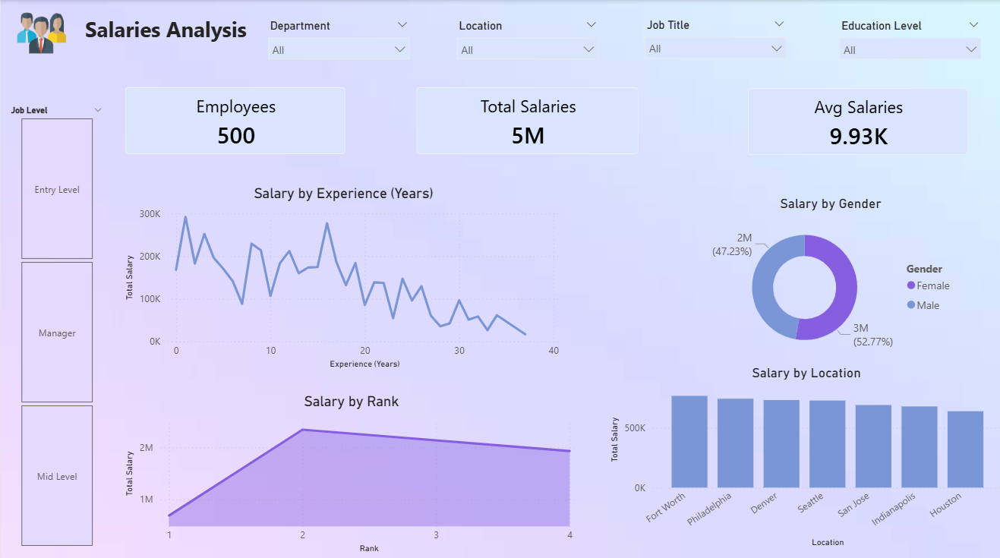

# Salaries Analysis Dashboard

## 📊 Project Overview
Interactive Power BI dashboard analyzing salary distribution for employees. 
Covers KPIs, filters, and insights by experience, rank, location, gender, and department using DAX and data modeling.

## 📈 Visualizations Used
1. **KPI Cards** – Employees, Total Salaries, Avg Salaries
2. **Line Chart** – Salary by Experience (Years)
3. **Donut Chart** – Salary by Gender
4. **Bar Chart** – Salary by Location
5. **Area Chart** – Salary by Rank
6. **Slicers** – Multi-level filtering for deep dive analysis

## 🛠️ Tools & Skills
- **Tool**: Power BI Desktop
- **Data Source**: Excel
- **Skills**: 
    - Data Modeling & Relationships
    - DAX Measures: `SUM`, `AVERAGE`, `COUNT`
    - Data Cleaning with Power Query
    - Dashboard Design Power BI

## 📂 Files in this Repo
- `Salaries-Analysis-Dashboard.pbix` – Power BI file
- `Dashboard-Screenshot.png` – Preview imag
- 
- ## 📷 Dashboard Preview

